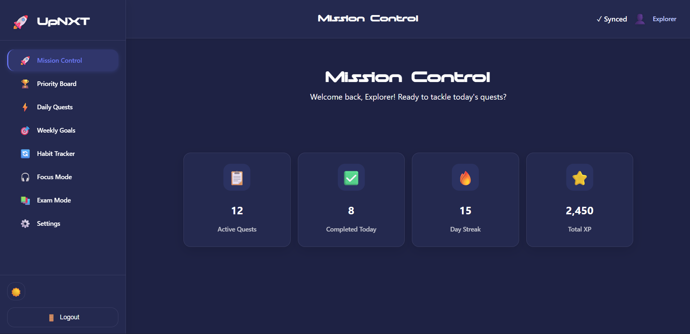
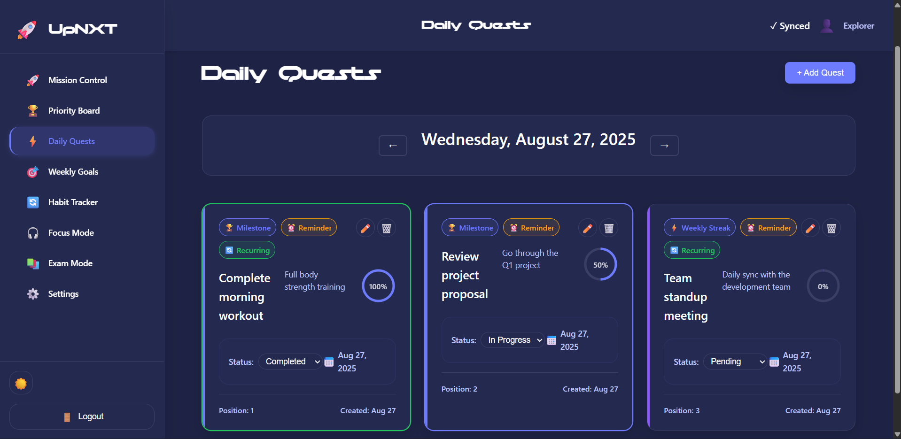
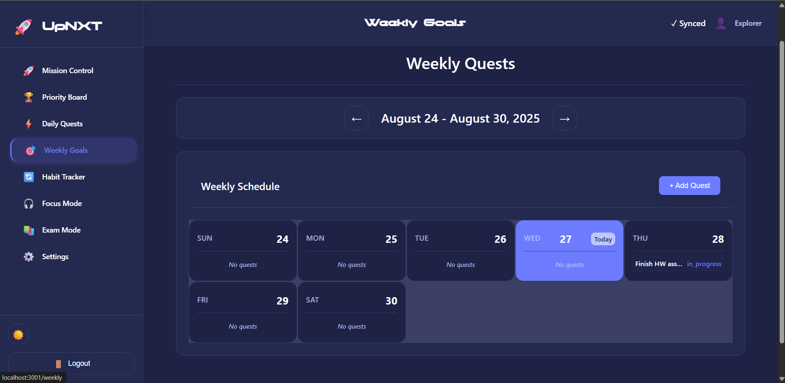
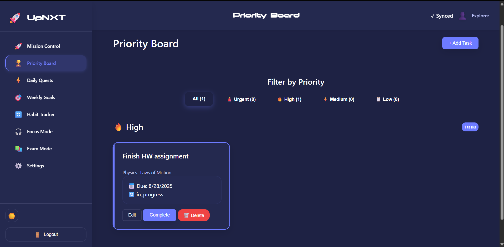
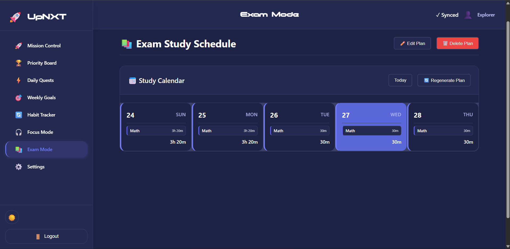
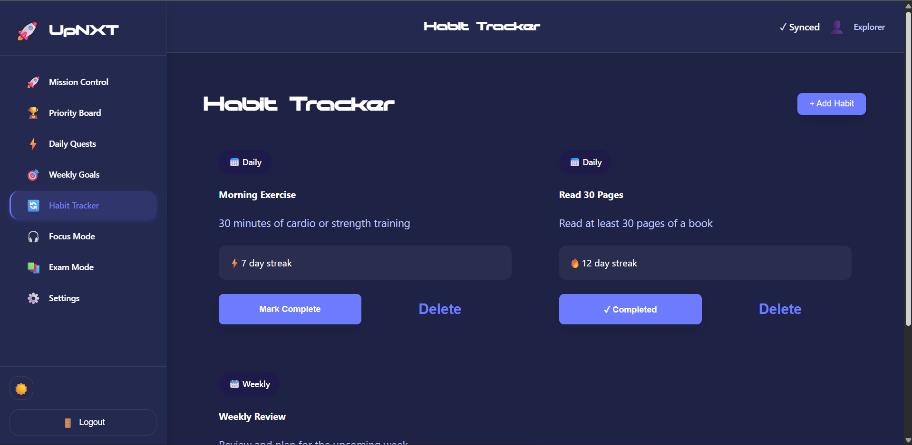
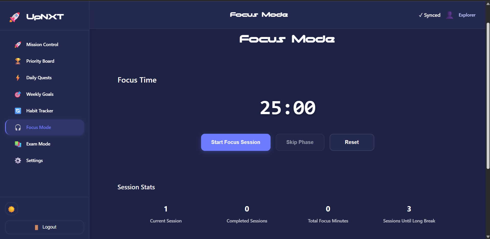
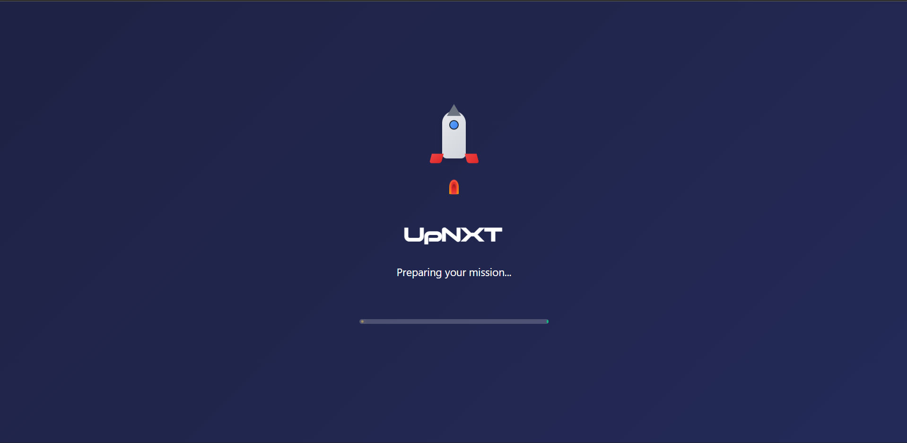

# 🚀 UpNxt – Gamified Planner for Students

**UpNxt** is a focus planner app designed for students to manage **daily tasks, exams, and habits** — with a fun **gamified quest-based UI**.  
Built for the web (live), with mobile deployment (React Native + Expo) ready to go.

---

## ✨ Features
- 🎯 Daily Quests & Weekly Goals  
- 🏆 Priority Board with task filters  
- 📚 Exam Mode (auto study schedule)  
- 🔥 Habit Tracker with streaks  
- 🎮 Focus Mode (Pomodoro-style timer)  
- 🌙 Dark & Light mode toggle  

---

## 📸 Screenshots

### Mission Control

### Daily Quests

### Weekly Goals

### Priority Board

### Exam Mode

### Habit Tracker

### Focus Mode

### Load Screen

---

## 🛠 Tech Stack
- **Frontend:** React  
- **Backend:** Django REST + PostgreSQL  
- **Auth:** SuperTokens  
- **Mobile:** React Native + Expo (ready for store deployment)  

---

## 💰 Asking Price
**$6,500 (or best offer)**  
Listed on Microns.io.  

---

## 📬 Contact
Open to negotiation & happy to assist in transition.
